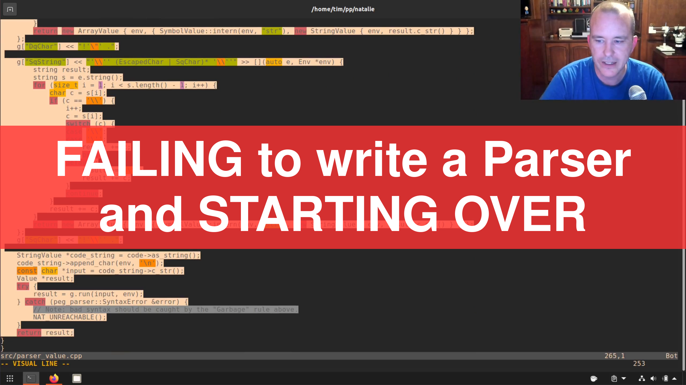

# Super simple thumbnail generator for my YouTube videos.

Requires imagemagick and ffmpeg to be installed. You probably also need the Helvetica-Bold font. Just tweak the script if it doesn't work!

Usage: `./thumbgen.sh "<video file>" <your title string>`
At least for now, provide the path to your video file in quotes, so it doesn't mess up the arguments parsing.
Better yet, submit a PR that fixes this obvious oversight!

## Example:

Run `./thumbgen.sh -t 141 -o 0.8 -bg 255,51,51 -fg 255,255,255 parser_fail.mp4 "FAILING to write a Parser and STARTING OVER"`

And you should get an image like this:



Not perfect, but hey, beats trying to make it in GIMP!

## Command Line Options

You can see the command line options by running with `-h`:

```
thumbgen - generate a video thumbnail with title

thumbgen.sh [options] videopath 'Title Goes Here'
 
options:
-h, --help       show brief help
-f FRAMENUM      specify a frame number manually (defaults to a random frame)
-t SECONDS       specify a time index in seconds
-bg RGB          specify background red green blue separated by comma (default '0,0,0')
-fg RGB          specify foreground red green blue separated by comma (default '0,0,0')
-o OPACITY       specify a opacity of the title overlay as a decimal number between 0.0 and 1.0 (default 0.8)
```

## Caveats

* ~~It currently assumes any given video file is precisely 1920x1080~~ *FIXED*
* It likely has bugs
* The text will overflow if you type in any more than the example above^
